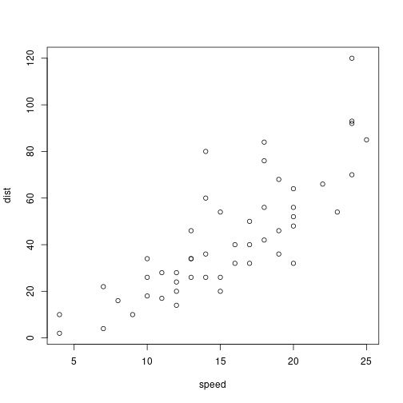

start_here
========================================================
author: 
date: 
autosize: true

First Slide
========================================================


- Open the data_carp_file.Rmd, Follow along and run the R chunks
- When get to the exercise part of the file, put your answer in the blank R chunk
- use the exercises.Rpres file to check your solution


Slide With Code
========================================================


```r
summary(cars)
```

```
     speed           dist       
 Min.   : 4.0   Min.   :  2.00  
 1st Qu.:12.0   1st Qu.: 26.00  
 Median :15.0   Median : 36.00  
 Mean   :15.4   Mean   : 42.98  
 3rd Qu.:19.0   3rd Qu.: 56.00  
 Max.   :25.0   Max.   :120.00  
```

Slide With Plot
========================================================


